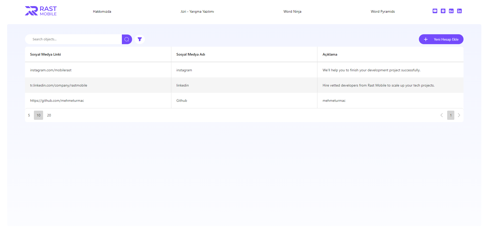
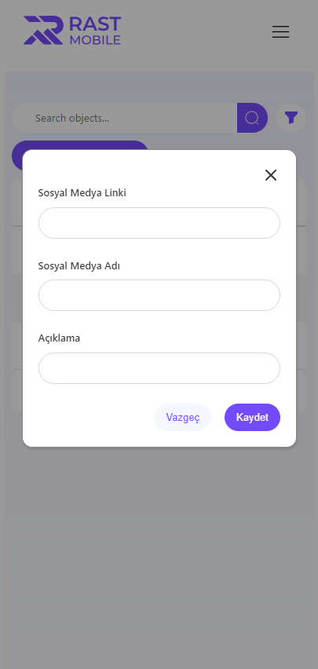

# Rast Mobile

> https://rastmobile-mu.netlify.app

Yukarıdaki linkten projenin live versiyonuna ulaşabilirsiniz.

---

Projeyi çalıştırabilmek için bilgisayarınızda **nodejs** kurulu olmalıdır. Çalıştırmak için konsola aşağıdaki kodu yazabilirsiniz;

```
'npm start' ya da 'yarn start'
```

Proje başladıktan sonra tarayıcınız üzerinde `localhost:3000` adresi ile ulaşabilirsiniz.

---



---

- Responsive design

<p float="left">
  
</p>

## License

[MIT](https://choosealicense.com/licenses/mit/)
